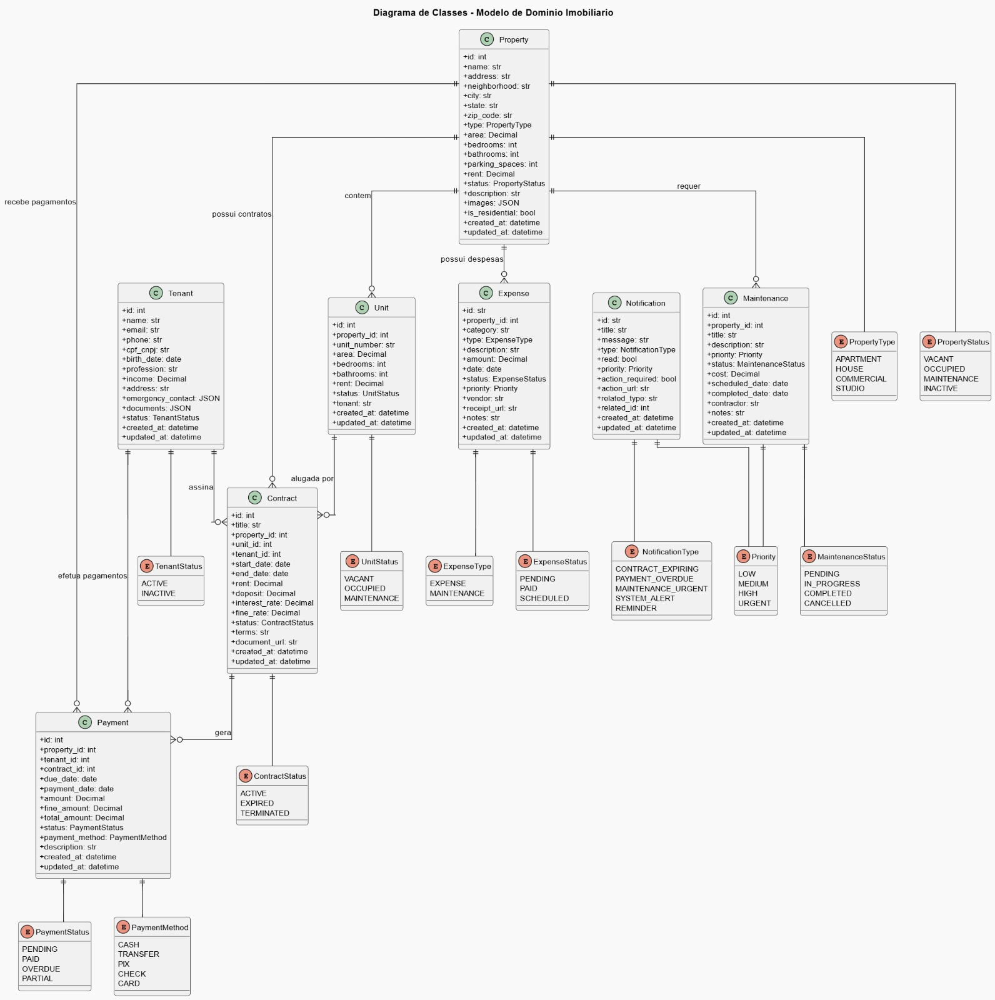

# 📦 Imobly Documentation

[](https://www.python.org/downloads/)
[](https://fastapi.tiangolo.com/)
[](https://www.docker.com/)
[](LICENSE)

Uma plataforma moderna e completa para gestão imobiliária, construída com FastAPI e seguindo as melhores práticas de desenvolvimento.

## ✨ Principais Funcionalidades

- 🏢 **Gestão de Propriedades** - Cadastro e gerenciamento completo
- 🏠 **Controle de Unidades** - Apartamentos, casas e espaços comerciais
- 👥 **Gerenciamento de Inquilinos** - Dados completos e histórico
- 📄 **Contratos Inteligentes** - Criação e acompanhamento automatizado
- 💰 **Sistema de Pagamentos** - Controle de recebimentos e inadimplência
- 💸 **Gestão de Despesas** - Controle de custos e manutenção
- 🔔 **Notificações** - Alertas automáticos e lembretes
- 📊 **Dashboard Analítico** - Métricas e relatórios em tempo real

## 🚀 Quick Start

### Com Docker (Recomendado)

```bash
# Clone o projeto
git clone https://github.com/seu-usuario/imobly-backend.git
cd imobly-backend

# Configure o ambiente
cp .env.example .env

# Execute o projeto
docker-compose up --build -d

# Acesse a documentação
# http://localhost:8000/docs
```

### Instalação Local

```bash
# Instale as dependências
pip install -r requirements.txt

# Configure o banco de dados
alembic upgrade head

# Execute o servidor
uvicorn app.main:app --reload
```

## 🏗️ Arquitetura

```
┌─────────────────┐    ┌─────────────────┐    ┌─────────────────┐
│   Frontend      │    │   API Layer     │    │   Database      │
│   (React/Vue)   │◄──►│   (FastAPI)     │◄──►│   (MySQL)       │
└─────────────────┘    └─────────────────┘    └─────────────────┘
                                │
                       ┌─────────────────┐
                       │   File Storage  │
                       │   (Local/S3)    │
                       └─────────────────┘
```

### Camadas da Aplicação

- **API Layer** - Endpoints REST com FastAPI
- **Business Logic** - Controllers e Services
- **Data Access** - Repositories com SQLAlchemy
- **Domain Models** - Entidades e regras de negócio

## 📚 Documentação

| Documento | Descrição |
|-----------|-----------|
| [Getting Started](GETTING_STARTED.md) | Guia completo de instalação e configuração |
| [API Documentation](API_DOCS.md) | Documentação completa da API REST |

## 🛠️ Stack Tecnológica

### Backend
- **FastAPI** - Framework web moderno e rápido
- **SQLAlchemy** - ORM avançado para Python
- **Pydantic** - Validação de dados com tipos
- **Alembic** - Migrações de banco de dados
- **Uvicorn** - Servidor ASGI de alta performance

### Database
- **MySQL 8.0** - Banco de dados principal

### DevOps
- **Docker & Docker Compose** - Containerização
- **Nginx** - Proxy reverso e servir arquivos estáticos
- **GitHub Actions** - CI/CD pipeline

## 📊 Diagrama UML



## 🧪 Qualidade do Código

### Testes


### Code Quality


## 🔐 Segurança


## 📈 Performance

### Benchmarks


### Otimizações


## 🔄 Roadmap

### v1.0 (MVP) ✅
- [ ] CRUD básico de propriedades
- [ ] Gestão de inquilinos
- [ ] Sistema de contratos
- [ ] Controle de pagamentos

### v1.1 (2025)
- [ ] Dashboard analytics
- [ ] Relatórios PDF
- [ ] Notificações por email
- [ ] API de integração

### v1.2 (2025)
- [ ] App mobile
- [ ] Integração com bancos
- [ ] Sistema de manutenção
- [ ] Multi-tenancy

### v2.0 (2025)
- [ ] IA para análise de mercado
- [ ] Automação de contratos
- [ ] Portal do inquilino
- [ ] Marketplace de serviços

## 🤝 Contribuindo

1. **Fork** o projeto
2. **Crie** uma branch para sua feature (`git checkout -b feature/nova-funcionalidade`)
3. **Commit** suas mudanças (`git commit -m 'feat: adiciona nova funcionalidade'`)
4. **Push** para a branch (`git push origin feature/nova-funcionalidade`)
5. **Abra** um Pull Request

### Convenções

- **Commits:** Conventional Commits
- **Branches:** feature/, fix/, docs/, refactor/
- **Code Style:** Black + Flake8
- **Testes:** Obrigatórios para novas features

## 📄 Licença

Este projeto está sob a licença MIT. Veja o arquivo [LICENSE](LICENSE) para mais detalhes.

## 📞 Suporte

- 📧 **Email:** devcostta@gmail.com
- 🐛 **Issues:** [GitHub Issues](https://github.com/seu-usuario/imobly-backend/issues)
- 💬 **Discussões:** [GitHub Discussions](https://github.com/seu-usuario/imobly-backend/discussions)
- 📚 **Docs:** [Documentação Completa](https://docs.imobly.com)

## 🏆 Equipe

Desenvolvido com ❤️ pela equipe Imobly

---

⭐ **Se este projeto foi útil para você, considere dar uma estrela!**