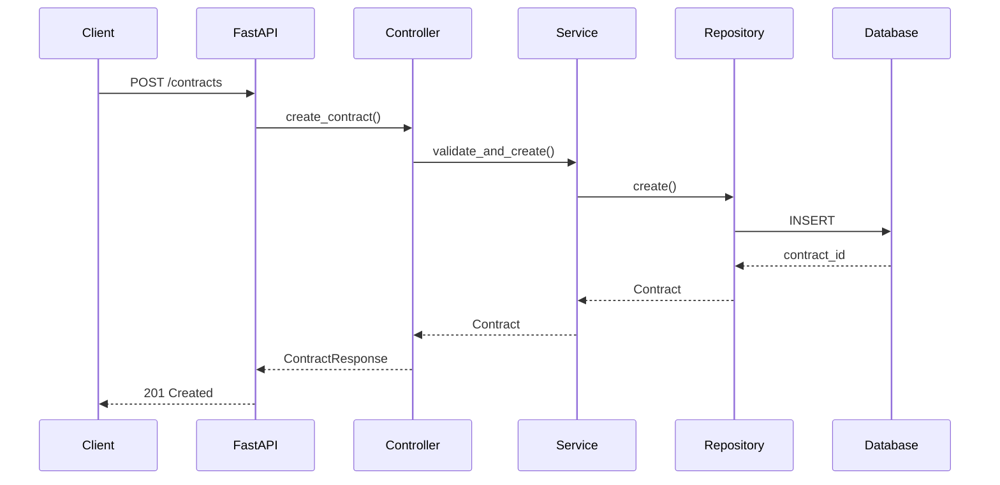
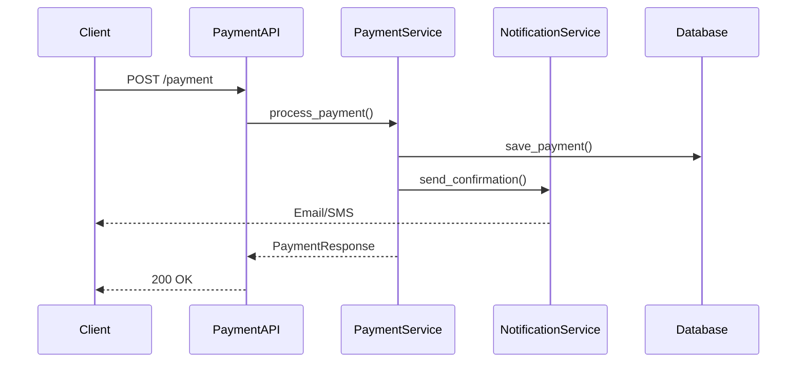

# 🏗️ Arquitetura do Sistema

Visão detalhada da arquitetura e decisões técnicas do Imobly.
{: .fs-6 .fw-300 }

## 📐 Visão Geral da Arquitetura

O Imobly segue uma arquitetura em camadas (Layered Architecture) combinada com padrões de Domain-Driven Design (DDD) para garantir escalabilidade e manutenibilidade.

```text
┌─────────────────────────────────────────────────────────────┐
│                    PRESENTATION LAYER                       │
│                   (FastAPI Endpoints)                       │
├─────────────────────────────────────────────────────────────┤
│                    APPLICATION LAYER                        │
│                  (Controllers & Services)                   │
├─────────────────────────────────────────────────────────────┤
│                     DOMAIN LAYER                            │
│                  (Models & Business Logic)                  │
├─────────────────────────────────────────────────────────────┤
│                  INFRASTRUCTURE LAYER                       │
│               (Database & External Services)                │
└─────────────────────────────────────────────────────────────┘
```

---

## 🎯 Principios Arquiteturais

### SOLID Principles
- **Single Responsibility**: Cada classe tem uma única responsabilidade
- **Open/Closed**: Aberto para extensão, fechado para modificação
- **Liskov Substitution**: Subclasses substituíveis por suas classes base
- **Interface Segregation**: Interfaces específicas e pequenas
- **Dependency Inversion**: Dependência de abstrações, não implementações

### Clean Architecture
- **Independência de Frameworks**: A lógica de negócio não depende de frameworks
- **Testabilidade**: Regras de negócio podem ser testadas sem UI, banco ou elementos externos
- **Independência de UI**: A UI pode mudar facilmente
- **Independência de Banco**: Oracle, SQL Server, MySQL, etc., são apenas detalhes
- **Independência de Agentes Externos**: As regras de negócio não sabem nada sobre o mundo exterior

---

## 📦 Estrutura de Camadas

### 1. Presentation Layer (API)

**Responsabilidade**: Interface com o mundo externo

```text
app/api/v1/
├── endpoints/
│   ├── properties.py       # Endpoints de propriedades
│   ├── tenants.py         # Endpoints de inquilinos
│   ├── contracts.py       # Endpoints de contratos
│   ├── payments.py        # Endpoints de pagamentos
│   └── auth.py           # Endpoints de autenticação
└── router.py             # Router principal da API
```

**Características**:
- Validação de entrada via Pydantic
- Serialização de resposta
- Tratamento de exceções HTTP
- Documentação automática (OpenAPI)

### 2. Application Layer (Controllers)

**Responsabilidade**: Coordenação e orquestração de operações

```text
app/controllers/
├── property_controller.py
├── tenant_controller.py
├── contract_controller.py
├── payment_controller.py
└── auth_controller.py
```

**Características**:
- Lógica de aplicação
- Coordenação entre serviços
- Validação de regras de negócio
- Tratamento de transações

### 3. Domain Layer (Models)

**Responsabilidade**: Regras de negócio e entidades

```text
app/models/
├── property.py           # Entidade Propriedade
├── tenant.py            # Entidade Inquilino
├── contract.py          # Entidade Contrato
├── payment.py           # Entidade Pagamento
├── expense.py           # Entidade Despesa
└── notification.py      # Entidade Notificação
```

**Características**:
- Entidades de domínio
- Regras de negócio
- Validações de domínio
- Value Objects

### 4. Infrastructure Layer (Data Access)

**Responsabilidade**: Acesso a dados e serviços externos

```text
app/
├── repositories/         # Repositórios de dados
├── services/            # Serviços externos
├── db/                  # Configuração de banco
└── external/            # APIs externas
```

---

## 🗄️ Modelo de Dados

### Entidades Principais

#### Property (Propriedade)
```python
class Property(Base):
    __tablename__ = "properties"
    
    id: int
    name: str
    address: str
    type: PropertyType
    total_units: int
    owner_name: str
    
    # Relacionamentos
    units: List[Unit]
    contracts: List[Contract]
    payments: List[Payment]
    expenses: List[Expense]
```

#### Contract (Contrato)
```python
class Contract(Base):
    __tablename__ = "contracts"
    
    id: int
    property_id: int
    tenant_id: int
    start_date: date
    end_date: date
    rent_amount: Decimal
    status: ContractStatus
    
    # Relacionamentos
    property: Property
    tenant: Tenant
    payments: List[Payment]
```

### Relacionamentos
- **Property** ↔ **Unit**: 1:N (Uma propriedade tem múltiplas unidades)
- **Property** ↔ **Contract**: 1:N (Uma propriedade tem múltiplos contratos)
- **Tenant** ↔ **Contract**: 1:N (Um inquilino pode ter múltiplos contratos)
- **Contract** ↔ **Payment**: 1:N (Um contrato gera múltiplos pagamentos)

---

## 🔧 Padrões de Design Utilizados

### Repository Pattern
```python
class PropertyRepository:
    def __init__(self, db: Session):
        self.db = db
    
    def get_by_id(self, property_id: int) -> Optional[Property]:
        return self.db.query(Property).filter(Property.id == property_id).first()
    
    def create(self, property_data: PropertyCreate) -> Property:
        # Implementação da criação
        pass
```

### Service Layer Pattern
```python
class PropertyService:
    def __init__(self, repository: PropertyRepository):
        self.repository = repository
    
    def create_property(self, property_data: PropertyCreate) -> Property:
        # Validações de negócio
        # Criação da propriedade
        return self.repository.create(property_data)
```

### Dependency Injection
```python
def get_property_service(
    db: Session = Depends(get_database)
) -> PropertyService:
    repository = PropertyRepository(db)
    return PropertyService(repository)
```

---

## 🔌 Integrações e APIs

### APIs Internas
- **Auth API**: Autenticação e autorização
- **Property API**: Gestão de propriedades
- **Payment API**: Processamento de pagamentos
- **Notification API**: Sistema de notificações

### APIs Externas (Futuro)
- **Payment Gateways**: Stripe, PayPal, PagSeguro
- **Email Services**: SendGrid, Amazon SES
- **SMS Services**: Twilio, AWS SNS
- **Storage Services**: AWS S3, Google Cloud Storage

---

## 📊 Fluxo de Dados

### Criação de Contrato


### Processamento de Pagamento


---

## 🚀 Escalabilidade

### Estratégias de Escalabilidade

#### Horizontal Scaling
- **Load Balancers**: Nginx, HAProxy
- **Container Orchestration**: Kubernetes, Docker Swarm
- **Database Clustering**: MySQL Master-Slave

#### Vertical Scaling
- **Resource Optimization**: CPU, Memory, Disk
- **Database Optimization**: Indexes, Query Optimization
- **Caching**: Redis, Memcached

#### Microservices (Futuro)
```text
┌─────────────────┐  ┌─────────────────┐  ┌─────────────────┐
│   Auth Service  │  │Property Service │  │Payment Service  │
│   (Port 8001)   │  │   (Port 8002)   │  │   (Port 8003)   │
└─────────────────┘  └─────────────────┘  └─────────────────┘
          │                    │                    │
          └────────────────────┼────────────────────┘
                               │
                    ┌─────────────────┐
                    │  API Gateway    │
                    │   (Port 8000)   │
                    └─────────────────┘
```

---

## 🔐 Segurança

### Autenticação e Autorização
- **JWT Tokens**: Stateless authentication
- **Role-Based Access Control (RBAC)**: Controle granular de permissões
- **Password Hashing**: bcrypt para senhas
- **Rate Limiting**: Proteção contra ataques

### Validação de Dados
- **Input Validation**: Pydantic schemas
- **SQL Injection Prevention**: SQLAlchemy ORM
- **XSS Prevention**: Sanitização de dados
- **CSRF Protection**: Tokens CSRF

### Criptografia
```python
# Exemplo de hash de senha
from passlib.context import CryptContext

pwd_context = CryptContext(schemes=["bcrypt"], deprecated="auto")

def hash_password(password: str) -> str:
    return pwd_context.hash(password)
```

---

## 📈 Monitoramento e Observabilidade

### Métricas
- **Application Metrics**: Latência, throughput, error rate
- **Infrastructure Metrics**: CPU, memória, disco, rede
- **Business Metrics**: Usuários ativos, conversões, receita

### Logging
```python
import logging

logger = logging.getLogger(__name__)

@app.middleware("http")
async def log_requests(request: Request, call_next):
    start_time = time.time()
    response = await call_next(request)
    process_time = time.time() - start_time
    
    logger.info(f"{request.method} {request.url} - {response.status_code} - {process_time:.4f}s")
    return response
```

### Health Checks
```python
@app.get("/health")
async def health_check():
    return {
        "status": "healthy",
        "timestamp": datetime.utcnow(),
        "version": "1.0.0"
    }
```

---

## 🧪 Testabilidade

### Tipos de Testes
- **Unit Tests**: Testam componentes isolados
- **Integration Tests**: Testam integração entre componentes
- **E2E Tests**: Testam fluxos completos
- **Performance Tests**: Testam performance e carga

### Estrutura de Testes
```text
tests/
├── unit/
│   ├── test_models.py
│   ├── test_services.py
│   └── test_repositories.py
├── integration/
│   ├── test_api.py
│   └── test_database.py
└── e2e/
    └── test_workflows.py
```

---

## 🔮 Roadmap Arquitetural

### Fase 1 (Atual) - Monolito Modular
- ✅ Arquitetura em camadas
- ✅ Separação de responsabilidades
- ✅ Padrões de design aplicados

### Fase 2 - Otimização
- 🔄 Cache distribuído (Redis)
- 🔄 Message Queue (RabbitMQ/Kafka)
- 🔄 Background tasks (Celery)

### Fase 3 - Microserviços
- 🔮 Decomposição em microserviços
- 🔮 Service mesh (Istio)
- 🔮 Event-driven architecture

### Fase 4 - Cloud Native
- 🔮 Kubernetes deployment
- 🔮 Serverless functions
- 🔮 Multi-cloud strategy

---

Esta arquitetura foi projetada para crescer com o negócio, mantendo a simplicidade inicial enquanto permite evolução para padrões mais complexos conforme a necessidade.