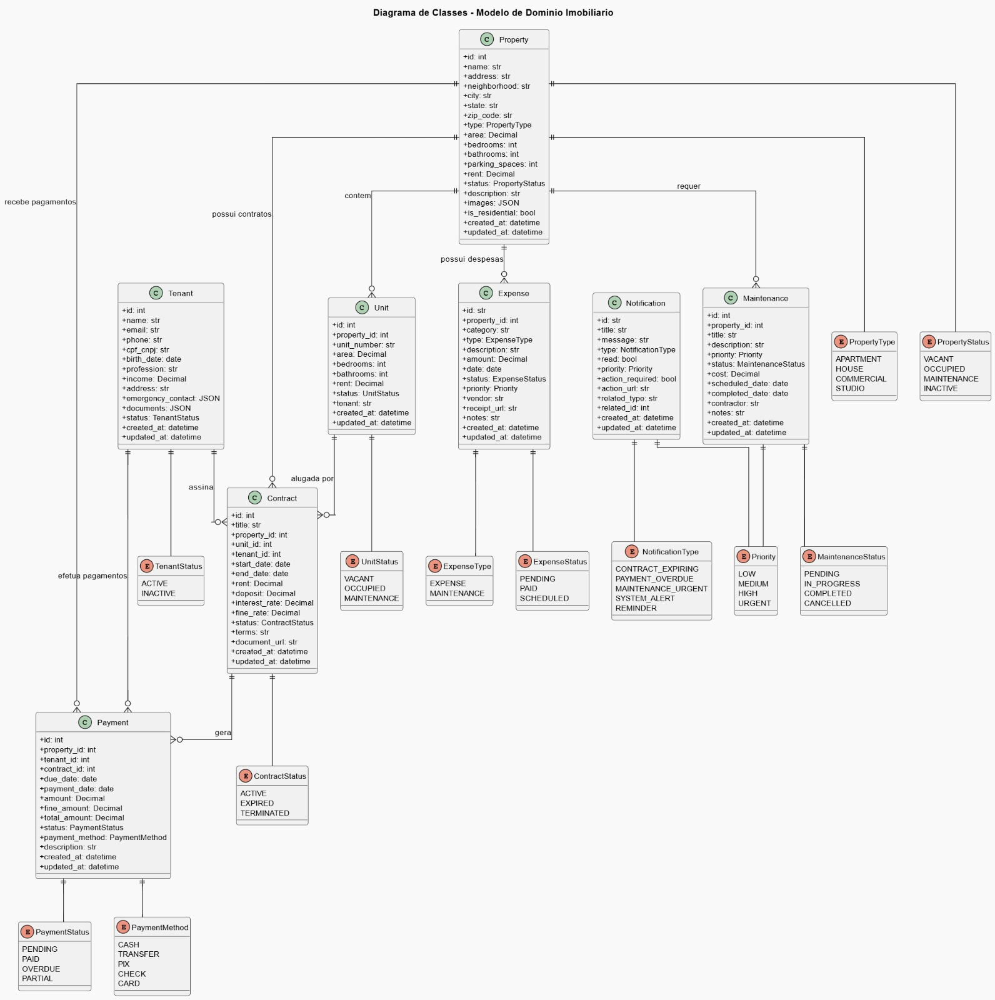
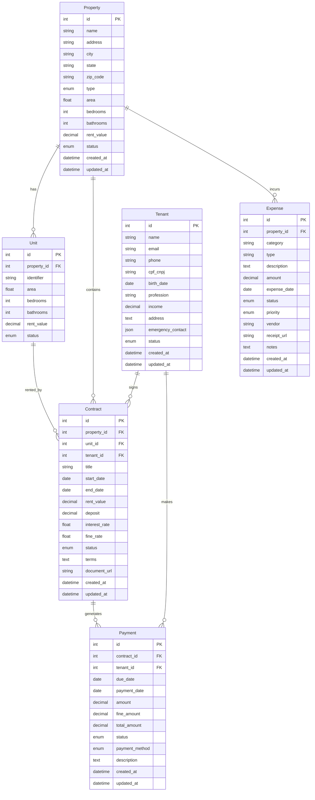
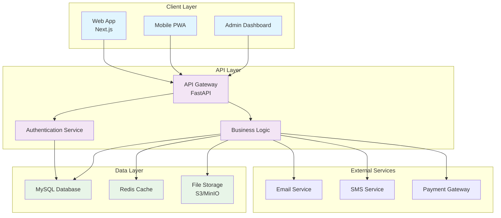

# Modelagem e Diagramas

Esta seção contém todos os diagramas e modelagens do sistema Imobly.

## Diagrama de Classes UML

O diagrama de classes mostra a estrutura principal do sistema:

## Modelagem do Banco de Dados

### Modelo Conceitual

## Diagrama de Arquitetura

## Próximos Diagramas

Esta seção será expandida com:

- **Modelo Físico do Banco** - Estrutura detalhada das tabelas
- **Diagrama de Sequência** - Fluxos de autenticação e operações
- **Diagrama de Casos de Uso** - Funcionalidades do sistema
- **Arquitetura de Deploy** - Infraestrutura de produção

## Arquivo PlantUML

O arquivo `diagramaDeClasses.wsd` contém a definição completa do diagrama de classes em formato PlantUML, que pode ser editado e regenerado conforme necessário.