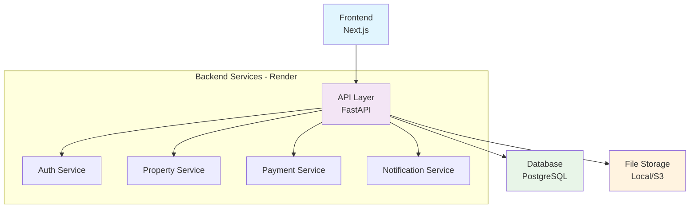

# 🏢 Imobly Documentation

Sistema completo de gestão imobiliária moderno e escalável.


[](https://github.com/Imobly/Documentation)
[](https://demo.imobly.com)

## 🎯 Visão Geral

O **Imobly** é uma plataforma completa para gestão imobiliária que oferece controle total sobre propriedades, inquilinos, contratos, pagamentos e despesas através de uma interface moderna e intuitiva.


## ✨ Principais Funcionalidades

<div class="grid cards" markdown>

-   :material-home-city:{ .lg .middle } **Gestão de Propriedades**

    ---

    Cadastro e gerenciamento completo de propriedades com múltiplas unidades

-   :material-account-group:{ .lg .middle } **Gerenciamento de Inquilinos**

    ---

    Dados completos dos inquilinos com histórico e documentação

-   :material-file-document:{ .lg .middle } **Contratos Inteligentes**

    ---

    Criação e acompanhamento automatizado de contratos de locação

-   :material-currency-usd:{ .lg .middle } **Sistema de Pagamentos**

    ---

    Controle completo de recebimentos e gestão de inadimplência

-   :material-chart-line:{ .lg .middle } **Dashboard Analítico**

    ---

    Métricas e relatórios em tempo real para tomada de decisões

-   :material-bell:{ .lg .middle } **Notificações Automáticas**

    ---

    Alertas e lembretes para vencimentos e eventos importantes

</div>

## 🚀 Início rápido

=== "Docker (Recomendado)"

    ```bash
    # Clone o projeto
    git clone https://github.com/Imobly/imobly-backend.git
    cd imobly-backend

    # Configure o ambiente
    cp .env.example .env

    # Execute o projeto
    docker-compose up --build -d
    ```

=== "Instalação Local"

    ```bash
    # Instale as dependências
    pip install -r requirements.txt

    # Configure o banco de dados
    alembic upgrade head

    # Execute o servidor
    uvicorn app.main:app --reload
    ```

!!! success "Acesse a Documentação"
    Após a instalação, acesse: [http://localhost:8000/docs](http://localhost:8000/docs)

## 🌐 Aplicação em Produção

O sistema Imobly está disponível em produção na plataforma **Render**:

| Serviço | URL | Descrição |
|---------|-----|-----------|
| **Frontend** | [imobly.onrender.com](https://imobly.onrender.com) | Interface web do sistema |
| **Backend API** | [backend-non0.onrender.com](https://backend-non0.onrender.com) | API principal |
| **Auth API** | [auth-api-3zxk.onrender.com](https://auth-api-3zxk.onrender.com) | Serviço de autenticação |
| **API Docs (Backend)** | [backend-non0.onrender.com/docs](https://backend-non0.onrender.com/docs) | Documentação Swagger |
| **API Docs (Auth)** | [auth-api-3zxk.onrender.com/docs](https://auth-api-3zxk.onrender.com/docs) | Documentação Swagger |

!!! note "Serviços em Cold Start"
    Os serviços podem levar alguns segundos para responder na primeira requisição após períodos de inatividade (cold start).

## 🏗️ Arquitetura



## 🛠️ Stack Tecnológica

### Frontend
- **Next.js** - Framework React para produção

### Backend
- **FastAPI** - Framework web moderno e rápido
- **SQLAlchemy** - ORM avançado para Python
- **Pydantic** - Validação de dados com tipos
- **PostgreSQL** - Banco de dados principal

### DevOps
- **Docker & Docker Compose** - Containerização
- **GitHub Actions** - CI/CD pipeline
- **Render** - Plataforma de hosting
- **Nginx** - Proxy reverso

## 📚 Navegação

<div class="grid cards" markdown>

-   :rocket:{ .lg .middle } **[Getting Started](guides/getting-started.md)**

    ---

    Guia completo de instalação e configuração inicial

-   :material-cog:{ .lg .middle } **[Arquitetura](guides/architecture.md)**

    ---

    Visão detalhada da arquitetura do sistema

-   :material-chart-box:{ .lg .middle } **[Modelagem](diagrams/index.md)**

    ---

    Diagramas UML e modelagem do banco de dados

-   :material-api:{ .lg .middle } **[API Reference](api/index.md)**

    ---

    Documentação completa da API REST

-   :material-shield-lock:{ .lg .middle } **[Autenticação](auth/index.md)**

    ---

    Sistema de autenticação e autorização

</div>

## 🤝 Contribuindo

1. **Fork** o projeto
2. **Crie** uma branch para sua feature (`git checkout -b feature/nova-funcionalidade`)
3. **Commit** suas mudanças (`git commit -m 'feat: adiciona nova funcionalidade'`)
4. **Push** para a branch (`git push origin feature/nova-funcionalidade`)
5. **Abra** um Pull Request

!!! tip "Convenções"
    - **Commits:** Conventional Commits
    - **Branches:** feature/, fix/, docs/, refactor/
    - **Code Style:** Black + Flake8
    - **Testes:** Obrigatórios para novas features

## 📄 Licença

Este projeto está sob a licença MIT. Veja o arquivo [LICENSE](https://github.com/Imobly/Documentation/blob/main/LICENSE) para mais detalhes.

## 📞 Suporte

- :material-email: **Email:** devcostta@gmail.com
- :material-bug: **Issues:** [GitHub Issues](https://github.com/Imobly/Documentation/issues)
- :material-chat: **Discussões:** [GitHub Discussions](https://github.com/Imobly/Documentation/discussions)

---

!!! success "⭐ Gostou do projeto?"
    Se esta documentação foi útil para você, considere dar uma estrela no repositório!